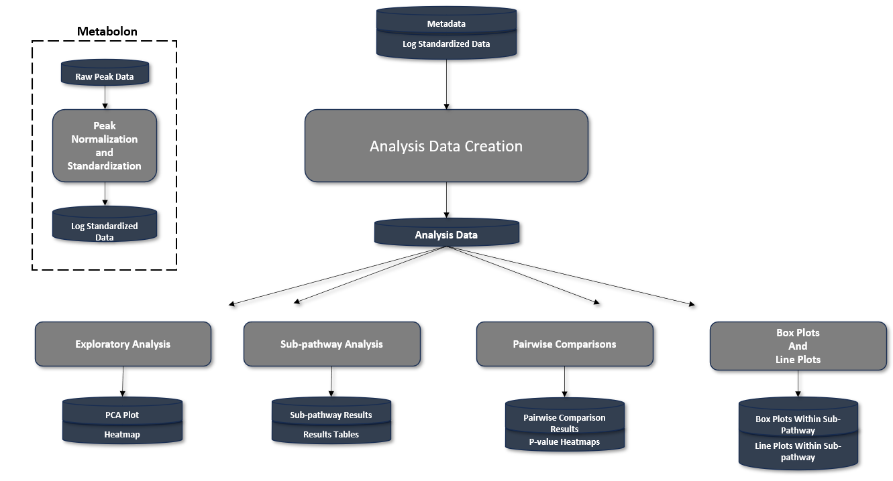

<!-- README.md is generated from README.Rmd. Please edit that file -->

# MetabolomicsPipeline

<!-- badges: start -->
<!-- badges: end -->

The purpose of the MetabolomicsPipeline is to provide tools for
additional analyses to complement the metabolomic analysis done by
Metabolon. Below is a demonstration of a potential workflow using the
MetabolomicsPipeline Package. We demonstrate this workflow in the
“Workflow” vignette.



Each step of the workflow is found in the Code folder.

1.  Normalization and Standardization
    (NormalizationAndStandardization.R)

- This step is optional as it is already provided by Metabolon.

2.  Analysis Data Creation (AnalysisDataCreation.R)

3.  Exploratory Analysis (ExploratoryAnalysis.R)

4.  SubpathwayAnalysis (subpathwayAnalysis.R)

5.  Pairwise Comparisons (PairwiseAnalysis)

6.  Boxplots and Lineplots (BoxPlotsAndLinePlots.R)

## Installation of Package

You will need to have the R-version \> 4.3.2 to install the development
version of MetabolomicsPipeline from [GitHub](https://github.com/) with:

``` r
# install.packages("devtools")
devtools::install_github("JoelParkerUofA/MetabolomicsPipeline")
```

## Getting Started

We demonstrate a workflow using the MetabolomicsPipeline in the
“Workflow” vignette. In this vignette, we use data which consists of 86
samples (42 males, 44 females), three treatment groups, and the samples
were taken at three different time points. We walk through each analysis
step and demonstrate how to use the MetabolomicPipeline package on
metabolomic data from Metabolon.
