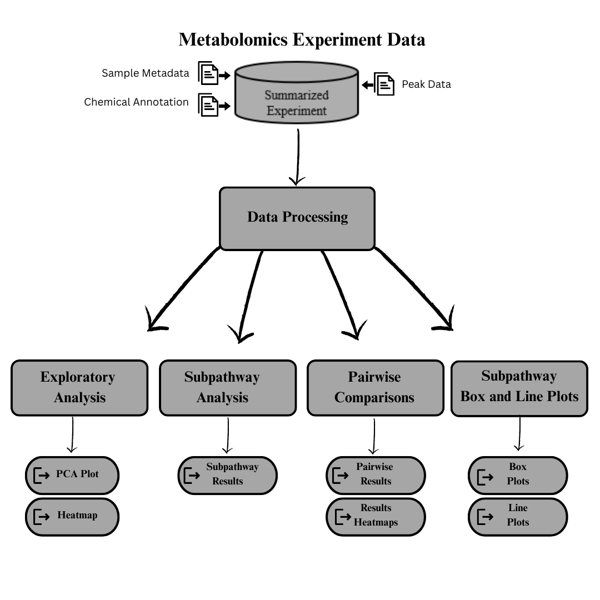

<!-- README.md is generated from README.Rmd. Please edit that file -->

# MetabolomicsPipeline

<!-- badges: start -->

[](https://www.tidyverse.org/lifecycle/#experimental)
[](https://github.com/JoelParkerUofA/MetabolomicsPipeline/commits/master)
<!-- badges: end -->

## Overview

The purpose of the MetabolomicsPipeline is to provide tools for
additional analyses to complement the metabolomic analysis done by
Metabolon. The MetabolomicsPipeline organizes Metabolon data in a
[SummarizedExperiment](https://bioconductor.org/packages/release/bioc/vignettes/SummarizedExperiment/inst/doc/SummarizedExperiment.html)
to allow for easy integration with other packages available on
Bioconductor.


Our package also provides functionality for:

1.  Loading Metabolon data into a Summarized Experiment
    (loadMetabolon())

2.  Exploratory analysis

- Heatmaps (metabolite_heatmap())

- PCA plots (metabolite_pca())

3.  Subpathway analysis (subpathway_analysis())

4.  Pairwise Comparisons (metabolite_pairwise())

5.  Boxplots and Line plots (subpathway_boxplots() and
    subpathway_lineplots())

Below is a simple workflow using the MetabolomicsPipeline package.



## Installation

The MetabolomicsPipeline requires R-version \>= 4.4.0.

### Install the release version from Bioconductor

``` r
if (!requireNamespace("BiocManager", quietly=TRUE))
    install.packages("BiocManager")

BiocManager::install(version="release")

BiocManager::install("MetabolomicsPipeline")
```

### Install from github

The following code will install the MetabolomicsPipeline package from
github while simultaneously building the vignette. In the vignette we
use a package called “table1”. If this package is not already installed,
the vignette will fail to build. We recommend installing the table1
package using the install.package(“table1”) command if you are going to
build the vignette. To install the MetabolomicsPipeline package and
build the vignette. You can use the following command.

``` r
if (!requireNamespace("devtools", quietly=TRUE))
    install.packages("devtools")
    
 devtools::install_github("datalifecycle-ua/MetabolomicsPipeline", build_vignettes = TRUE)
```

## Getting Started

We demonstrate a workflow using the MetabolomicsPipeline in a vignette.
In this vignette, we use data which consists of 86 samples (42 males, 44
females), three treatment groups, and the samples were taken at three
different time points. We walk through each of the above analyses and
demonstrate additional functionality for displaying the results. You can
view the vignette by using:

``` r
browseVignettes("MetabolomicsPipeline")
```
